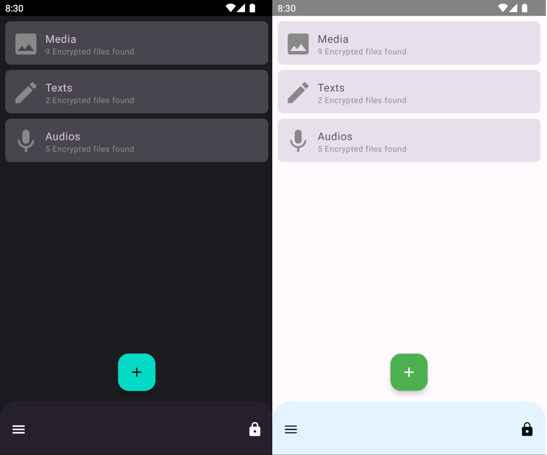

## Krypt

[](https://github.com/mehdiyari/krypt/actions/workflows/Integration.yml)  <br>

Krypt is a safe place on Android phones where we can store encrypted photos, videos, texts, and
files without concern about privacy.



## Architecture

Currently, we use Domain, Data and UI layer architecture. For the UI layer, we use
Model-View-ViewModel (MVVM) as presentation layer architecture, a popular design pattern used in
software development, particularly in building user interfaces. MVVM aims to separate the concerns
of data management, user interface rendering, and user interactions in a clean and maintainable way.
Also, we follow the repository patterns for the Data layer, and our Domain layer, which contains use
cases, is optional.

## Tests

We write unit tests for all functionalities, including repositories, use cases, data sources,
utility classes and view models with mockk, Junit and some standard libraries for testing in
Android.

## Stack

              

## License

```
Copyright 2023 Mehdi Yari

Licensed under the Apache License, Version 2.0 (the "License");
you may not use this file except in compliance with the License.
You may obtain a copy of the License at

    http://www.apache.org/licenses/LICENSE-2.0

Unless required by applicable law or agreed to in writing, software
distributed under the License is distributed on an "AS IS" BASIS,
WITHOUT WARRANTIES OR CONDITIONS OF ANY KIND, either express or implied.
See the License for the specific language governing permissions and
limitations under the License.
```